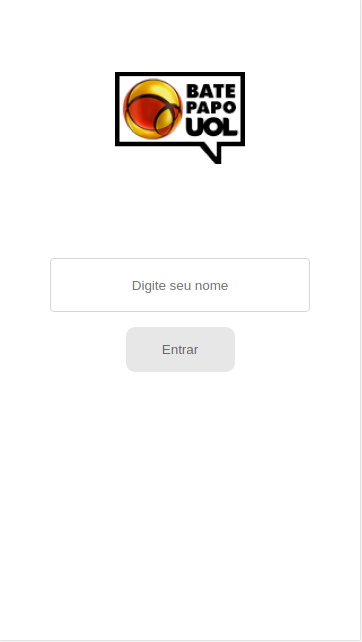
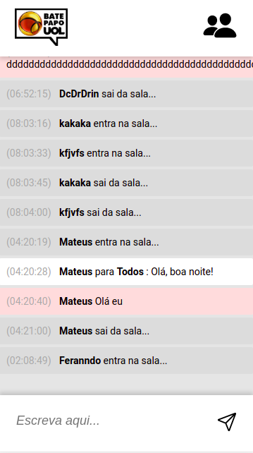
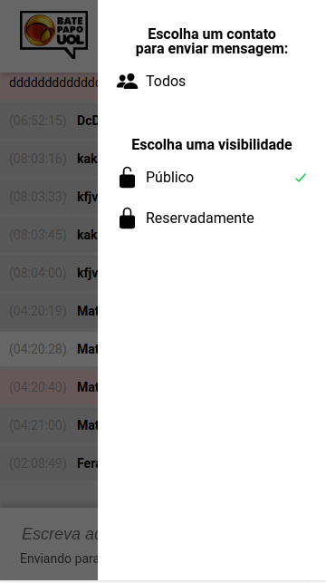
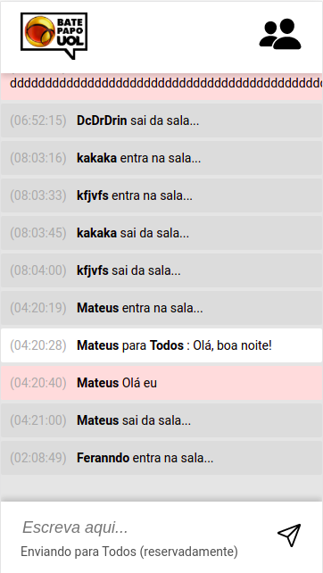

<h1 align="center">
    Projeto_BatePapo
</h1>

 

<h4 align="center"> 
	 Status: Entregue.
</h4>

## Sobre

Quinto projeto realizado durante o **Bootcamp Responde Aí** do [Responde Aí](https://page.respondeai.com.br/bootcamp).  

Terceiro projeto com JavaScript foi a implementação de um bate-papo totalmente funcional, inspirado no saudoso Bate-Papo UOL.

---

## Requisitos

- Chat
    - [x]  Ao entrar no site, este deve carregar as mensagens do servidor e exibi-las conforme layout fornecido
    
    - [x]  Existem 3 tipos de mensagem:
        - Mensagens de status (**Entrou** ou **Saiu** da sala): deve ter o fundo cinza
        - Mensagens reservadas (**Reservadamente**): deve ter o fundo rosa
        - Mensagens normais: devem ter o fundo branco
        
    - [x]  A cada 3 segundos o site deve re-carregar as mensagens do servidor para manter sempre atualizado
    
    - [x]  O chat deverá ter rolagem automática por padrão, ou seja, sempre que novas mensagens forem adicionadas ao final do chat ele deve scrollar para o final

    - [x]  As mensagens com **Reservadamente** só devem ser exibidas se o nome do destinatário for igual ao nome do usuário que está usando o chat (ou senão ele poderia ver as mensagens reservadas para outras pessoas)

- Entrada na sala
    - [x]  Ao entrar no site, o usuário deverá ser perguntado com um `prompt` ****seu lindo nome
    
    - [x]  Após inserção do nome, este deve ser enviado para o servidor pra cadastrar o usuário
        - Caso o servidor responda com sucesso, o usuário poderá entrar na sala
        - Caso o servidor responda com erro, deve-se pedir para o usuário digitar outro nome, pois este já está em uso
    
    - [x]  Enquanto o usuário estiver na sala, a cada 5 segundos o site deve avisar ao servidor que o usuário ainda está presente, ou senão será considerado que "Saiu da sala"

- Envio de mensagem
    - [x]  Ao enviar uma mensagem, esta deve ser enviada para o servidor
        - Caso o servidor responda com sucesso, você deve obter novamente as mensagens do servidor e atualizar o chat
        - Caso o servidor responda com erro, significa que esse usuário não está mais na sala e a página deve ser atualizada (e com isso voltando pra etapa de pedir o nome)

    - [x]  Nesse envio, deve ser informado o remetente, o destinatário e se a mensagem é reservada ou não.
        - Escolher um destinário e se a mensagem é reservada ou pública é um **requisito bônus** (ver abaixo). Logo, se você não implementar o bônus, sempre envie destinatário como **Todos** e a mensagem como **pública**.
---

## Layout

O layout da aplicação se encontra no Figma:

### Mobile

  
  

  
  

## Tech Used

Foram usadas as seguintes ferramentas para o desenvolvimento do projeto:

- ****
- ****
- ****

#### **Utilities**

- Prototype: **[Figma](https://www.figma.com/)** → **[Protótipo (Bate-Papo UOL)](https://www.figma.com/file/eviXSw3MnQVphvpalRT78c/Chat-UOL?node-id=0%3A1)**
- Editor: **[Visual Studio Code](https://code.visualstudio.com/)**
- Fonts: **[Roboto](https://fonts.google.com/specimen/Roboto)**

---

## Authors

<a style="border-radius: 50px;" width="100px;" href="https://github.com/fevalani">
 
  
 <b>Fernando Valani</b></a>
  

## 

## License

👋🏽 Get in Touch!

---
